# Mate

It's chess, mate!

# Core

## Board

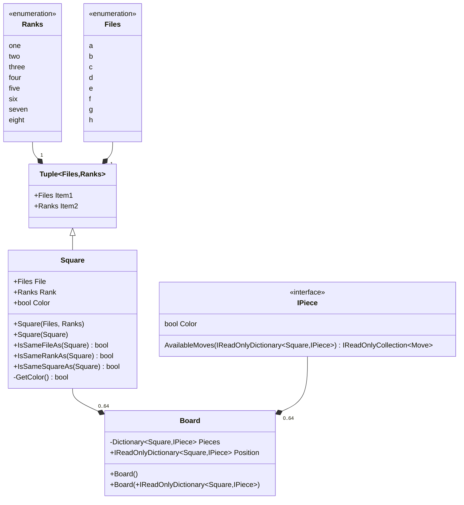

## Extensions

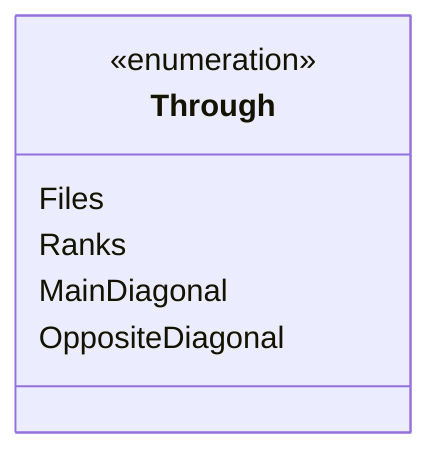

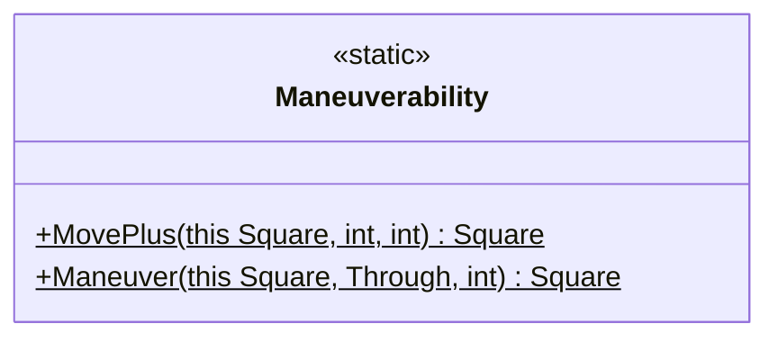
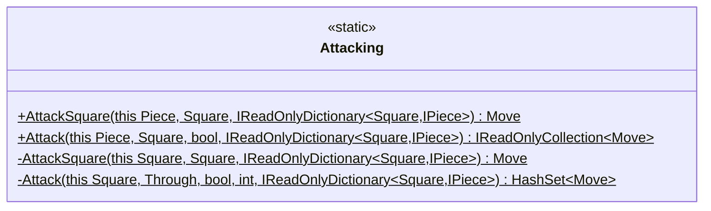
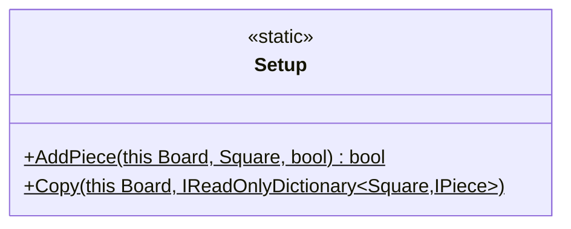
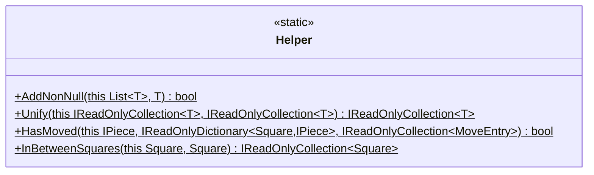
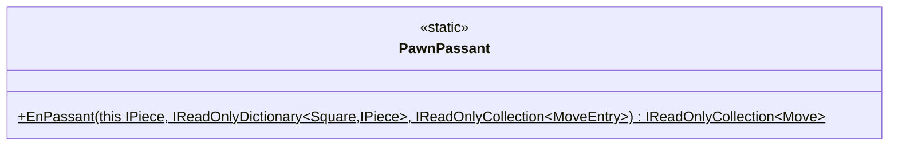
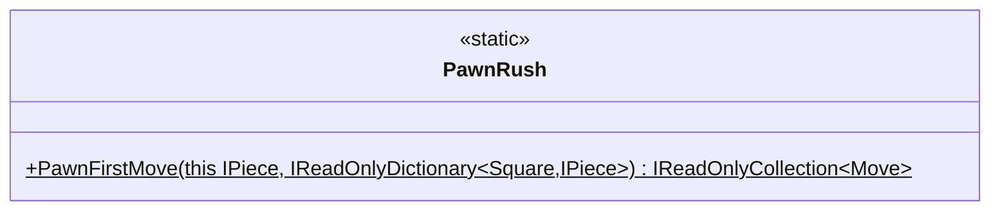
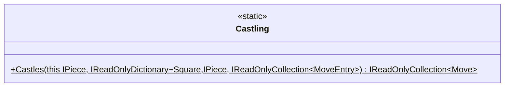
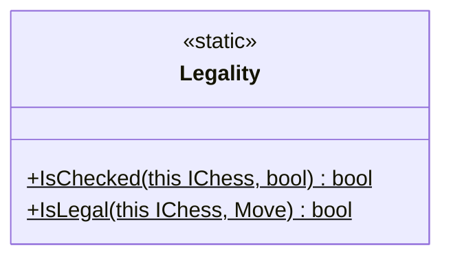

## Game


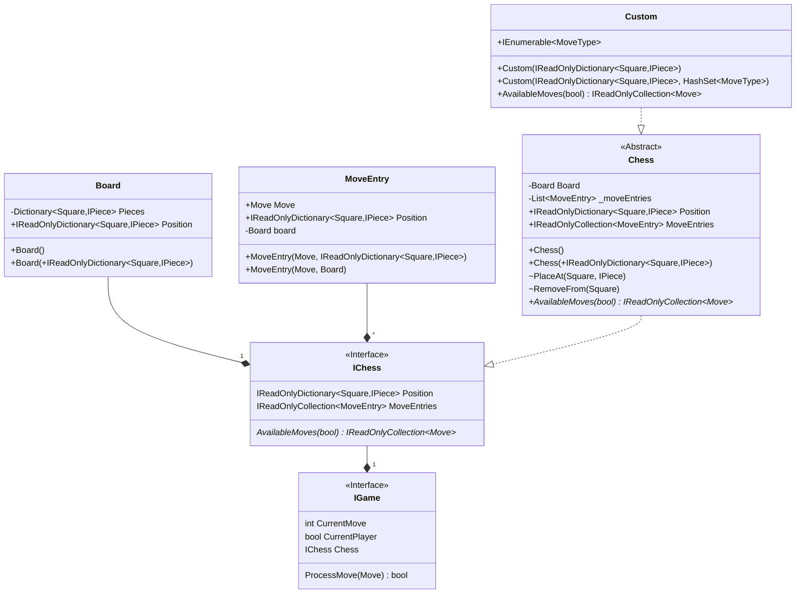

## Moves

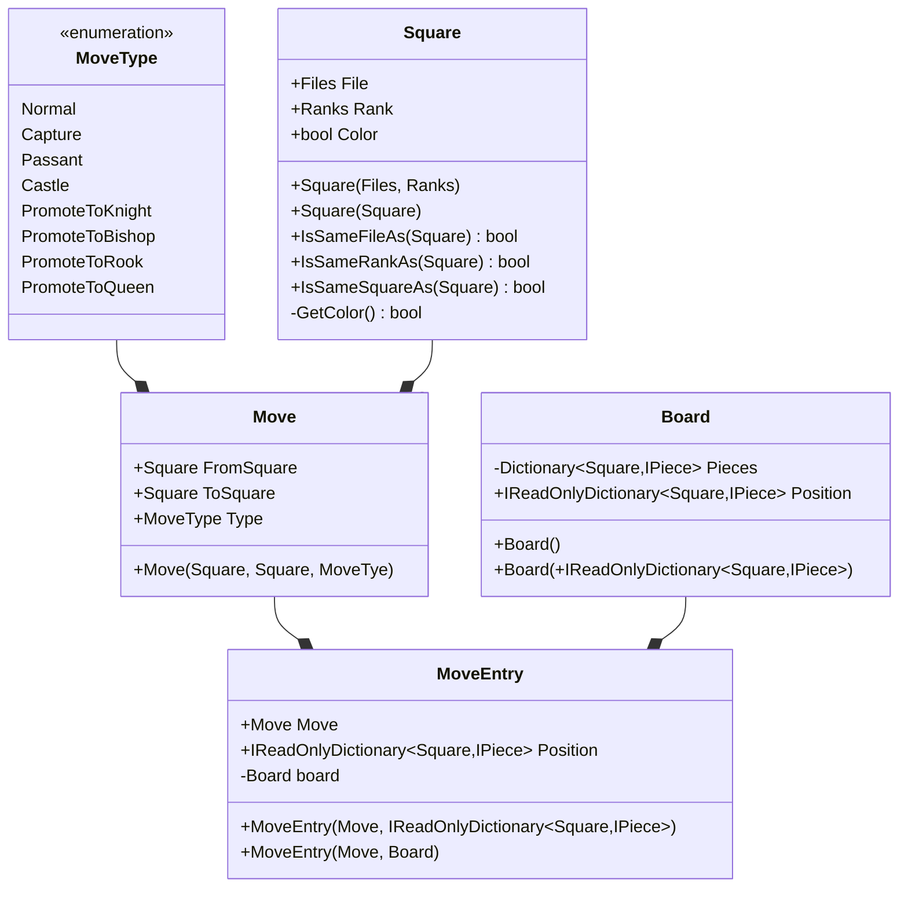

## Pieces

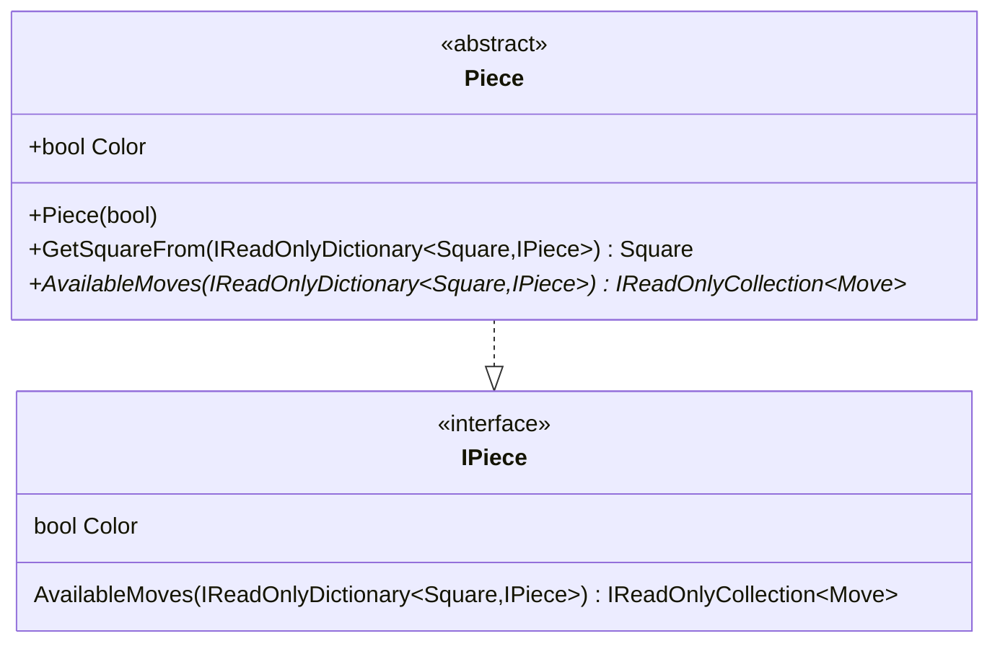
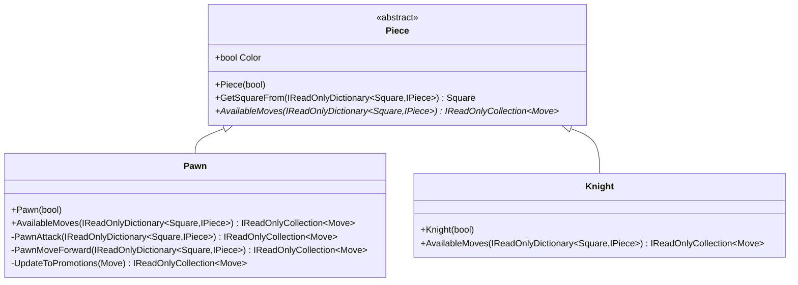
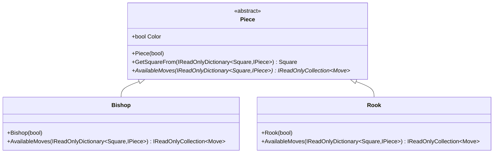
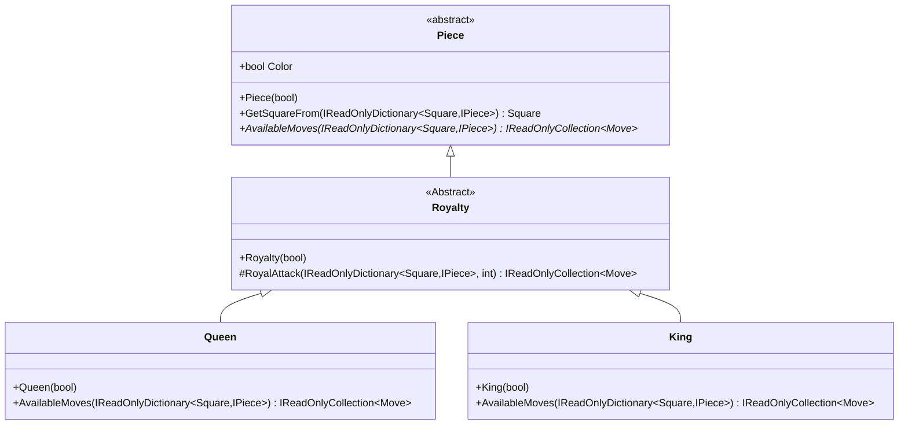

# Current Performance

```shell
Passed!  - Failed:     0, Passed:   136, Skipped:     0, Total:   136, Duration: 75 ms - Core.dll (net5.0)

Calculating coverage result...
  Generating report '..\.coverage\lcov.info'

+--------+--------+--------+--------+
| Module | Line   | Branch | Method |
+--------+--------+--------+--------+
| Mate   | 89,61% | 87,5%  | 91,13% |
+--------+--------+--------+--------+

+---------+--------+--------+--------+
|         | Line   | Branch | Method |
+---------+--------+--------+--------+
| Total   | 89,61% | 87,5%  | 91,13% |
+---------+--------+--------+--------+
| Average | 89,61% | 87,5%  | 91,13% |
+---------+--------+--------+--------+
```
