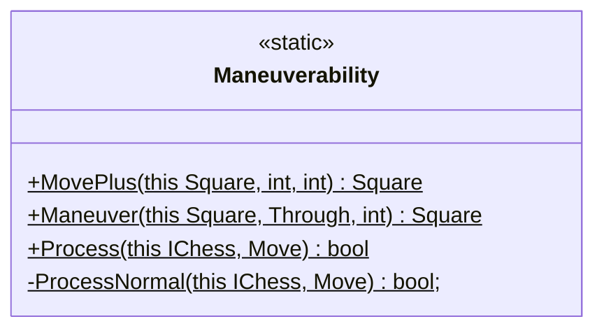
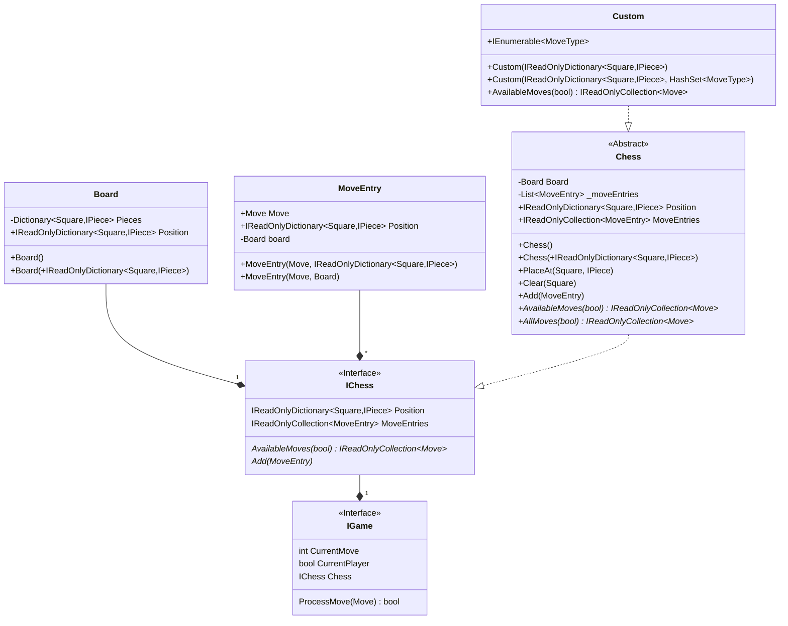
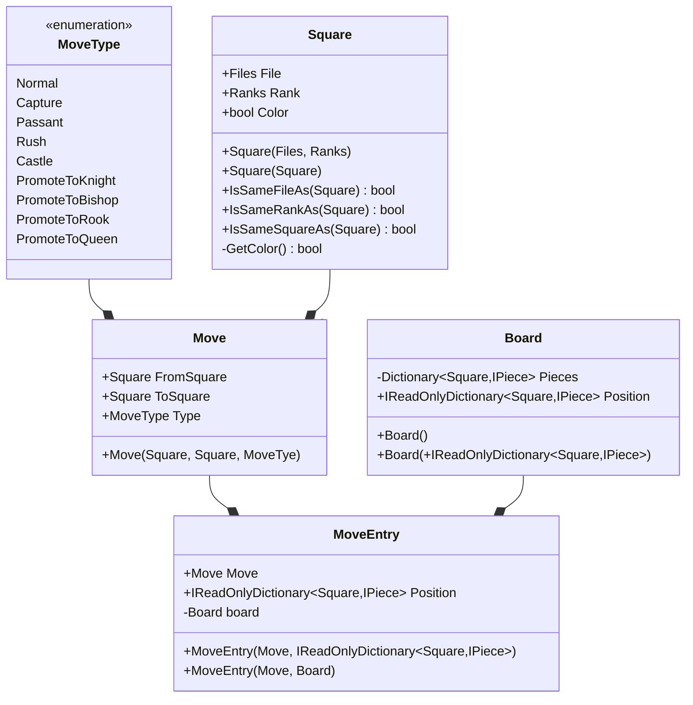

# Mate

It's chess, mate!

# Core

## Board


## Extensions
### Extensions Enumerations


### Attacking


### Helper


### Legality 


### Maneuverability



### Setup


## Specialized Moves

### Pawn Passant


### Pawn Rush


### Castling


## Game



## Moves



## Pieces


# Unit Testing Performance

```shell
A total of 1 test files matched the specified pattern.

Passed!  - Failed:     0, Passed:   155, Skipped:     0, Total:   156, Duration: 99 ms - Core.dll (net5.0)

Calculating coverage result...
  Generating report '..\.coverage\lcov.info'

+--------+--------+--------+--------+
| Module | Line   | Branch | Method |
+--------+--------+--------+--------+
| Mate   | 93,73% | 90,83% | 96,34% |
+--------+--------+--------+--------+

+---------+--------+--------+--------+
|         | Line   | Branch | Method |
+---------+--------+--------+--------+
| Total   | 93,73% | 90,83% | 96,34% |
+---------+--------+--------+--------+
| Average | 93,73% | 90,83% | 96,34% |
+---------+--------+--------+--------+
```
