# Mate

Mate is a passion project. It is my very own chess C# library and related API's. 

# Contents

* [Core UML Class Diagrams](#core-uml-class-diagrams)
    * [Board](#board)
    * [Chess](#chess)
    * [Game](#game)
    * [Match](#match)
    * [Moves](#moves)
    * [Pieces](#pieces)
    * [Extensions](#extensions)

# Core UML Class Diagrams

The core library can be found in `Source\Core`. It implements a chess match between players. It contains several different classes, representing multiple aspects of a game o chess. Bellow is a subdivision of each specific design choices for this class:
* Board;
* Chess;
* Game;
* Moves;
* Pieces.

Afterwards, a brief description of all extension classes is presented.

## Board

Represents a board of chess, containing several different pieces, placed at specific squares.

### Classes

* [Source\Core\Abstractions\Enumerations.cs](https://github.com/JeanLColombo/Mate/blob/main/Source/Core/Abstractions/Enumerations.cs);
    * Implements `Files` and `Ranks` enums;
* [Source\Core\Abstractions\IPiece.cs](https://github.com/JeanLColombo/Mate/blob/main/Source/Core/Abstractions/IPiece.cs);
* [Source\Core\Abstractions\Square.cs](https://github.com/JeanLColombo/Mate/blob/main/Source/Core/Abstractions/Square.cs);
    * Inherits from `Tuple`;
* [Source\Core\Elements\Board.cs](https://github.com/JeanLColombo/Mate/blob/main/Source/Core/Elements/Board.cs).

### Diagrams

## Chess

Represents the chess rules.

### Classes

* [Source\Core\Abstractions\Chess.cs](https://github.com/JeanLColombo/Mate/blob/main/Source/Core/Abstractions/Chess.cs);
* [Source\Core\Abstractions\IChess.cs](https://github.com/JeanLColombo/Mate/blob/main/Source/Core/Abstractions/IChess.cs);
* [Source\Core\Abstractions\MoveEntry.cs](https://github.com/JeanLColombo/Mate/blob/main/Source/Core/Abstractions/MoveEntry.cs);
* [Source\Core\Elements\Board.cs](https://github.com/JeanLColombo/Mate/blob/main/Source/Core/Elements/Board.cs);
* [Source\Core\Elements\Rules\Custom.cs](https://github.com/JeanLColombo/Mate/blob/main/Source/Core/Elements/Rules/Custom.cs).
* [Source\Core\Elements\Rules\Classical.cs](https://github.com/JeanLColombo/Mate/blob/main/Source/Core/Elements/Rules/Classical.cs)

### Diagrams

## Game

Represents the game dynamics and outcome.

### Classes

* [Source\Core\Abstractions\Enumerations.cs](https://github.com/JeanLColombo/Mate/blob/main/Source/Core/Abstractions/Enumerations.cs);
* [Source\Core\Abstractions\Game.cs](https://github.com/JeanLColombo/Mate/blob/main/Source/Core/Abstractions/Game.cs);
* [Source\Core\Abstractions\IChess.cs](https://github.com/JeanLColombo/Mate/blob/main/Source/Core/Abstractions/IChess.cs);
* [Source\Core\Abstractions\IGame.cs](https://github.com/JeanLColombo/Mate/blob/main/Source/Core/Abstractions/IGame.cs);
* [Source\Core\Elements\Games\Standard.cs](https://github.com/JeanLColombo/Mate/blob/main/Source/Core/Elements/Games/Standard.cs);

### Diagrams

## Match

Describes how the match logic behaves, by interfacing players actions and translating them to a game o chess.

### Classes

* [Source\Core\Abstractions\IMatch.cs](https://github.com/JeanLColombo/Mate/blob/main/Source/Core/Abstractions/IMatch.cs)
* [Source\Core\Abstractions\Match.cs](https://github.com/JeanLColombo/Mate/blob/main/Source/Core/Abstractions/Match.cs)

### Diagrams

## Moves

Describes piece maneuvers on the board, such as `MoveType.Capture` or `MoveType.Castle`.

### Classes

* [Source\Core\Abstractions\Enumerations.cs](https://github.com/JeanLColombo/Mate/blob/main/Source/Core/Abstractions/Enumerations.cs);
    * Implements `Files` and `Ranks` enums;
* [Source\Core\Abstractions\Move.cs](https://github.com/JeanLColombo/Mate/blob/main/Source/Core/Abstractions/Move.cs);
* [Source\Core\Abstractions\MoveEntry.cs](https://github.com/JeanLColombo/Mate/blob/main/Source/Core/Abstractions/MoveEntry.cs);
* [Source\Core\Abstractions\Square.cs](https://github.com/JeanLColombo/Mate/blob/main/Source/Core/Abstractions/Square.cs);
    * Inherits from `Tuple`;
* [Source\Core\Elements\Board.cs](https://github.com/JeanLColombo/Mate/blob/main/Source/Core/Elements/Board.cs).

### Diagrams

## Pieces

Represents chess pieces.

### Classes

* [Source\Core\Abstractions\IPiece.cs](https://github.com/JeanLColombo/Mate/blob/main/Source/Core/Abstractions/IPiece.cs);
* [Source\Core\Abstractions\Piece.cs](https://github.com/JeanLColombo/Mate/blob/main/Source/Core/Abstractions/Piece.cs);
* [Source\Core\Abstractions\Royalty.cs](https://github.com/JeanLColombo/Mate/blob/main/Source/Core/Abstractions/Royalty.cs);
* [Source\Core\Elements\Pieces\Bishop.cs](https://github.com/JeanLColombo/Mate/blob/main/Source/Core/Elements/Pieces/Bishop.cs);
* [Source\Core\Elements\Pieces\King.cs](https://github.com/JeanLColombo/Mate/blob/main/Source/Core/Elements/Pieces/King.cs);
* [Source\Core\Elements\Pieces\Knight.cs](https://github.com/JeanLColombo/Mate/blob/main/Source/Core/Elements/Pieces/Knight.cs);
* [Source\Core\Elements\Pieces\Pawn.cs](https://github.com/JeanLColombo/Mate/blob/main/Source/Core/Elements/Pieces/Pawn.cs);
* [Source\Core\Elements\Pieces\Queen.cs](https://github.com/JeanLColombo/Mate/blob/main/Source/Core/Elements/Pieces/Queen.cs);
* [Source\Core\Elements\Pieces\Rook.cs](https://github.com/JeanLColombo/Mate/blob/main/Source/Core/Elements/Pieces/Rook.cs).

### Diagrams
#### Abstract Piece Definition

#### Pawn and Knight

#### Bishop and Rook

#### King and Queen

## Extensions

### Classes

* [Source\Core\Abstractions\Enumerations.cs](https://github.com/JeanLColombo/Mate/blob/main/Source/Core/Abstractions/Enumerations.cs);
* [Source\Core\Extensions\Attacking.cs](https://github.com/JeanLColombo/Mate/blob/main/Source/Core/Extensions/Attacking.cs);
* [Source\Core\Extensions\Helper.cs](https://github.com/JeanLColombo/Mate/blob/main/Source/Core/Extensions/Helper.cs);
* [Source\Core\Extensions\Legality.cs](https://github.com/JeanLColombo/Mate/blob/main/Source/Core/Extensions/Legality.cs);
* [Source\Core\Extensions\Maneuverability.cs](https://github.com/JeanLColombo/Mate/blob/main/Source/Core/Extensions/Maneuverability.cs);
* [Source\Core\Extensions\Setup.cs](https://github.com/JeanLColombo/Mate/blob/main/Source/Core/Extensions/Setup.cs);
* [Source\Core\Extensions\SpecializedMoves\Castling.cs](https://github.com/JeanLColombo/Mate/blob/main/Source/Core/Extensions/SpecializedMoves/Castling.cs);
* [Source\Core\Extensions\SpecializedMoves\PawnPassant.cs](https://github.com/JeanLColombo/Mate/blob/main/Source/Core/Extensions/SpecializedMoves/PawnPassant.cs);
* [Source\Core\Extensions\SpecializedMoves\PawnRush.cs](https://github.com/JeanLColombo/Mate/blob/main/Source/Core/Extensions/SpecializedMoves/PawnRush.cs).

### Diagrams
#### Extensions Enumerations

#### Attacking

#### Helper

#### Legality 

#### Maneuverability

#### Setup

#### Specialized Moves

Specialized moves are moves that requires additional information, that the piece might not have, such as historical `MoveEntry` data.

##### Pawn Passant

Requires information regarding other pawns maneuvers on the board.

##### Pawn Rush

Pawns must not have been moved.

##### Castling

Castling rules must apply.

