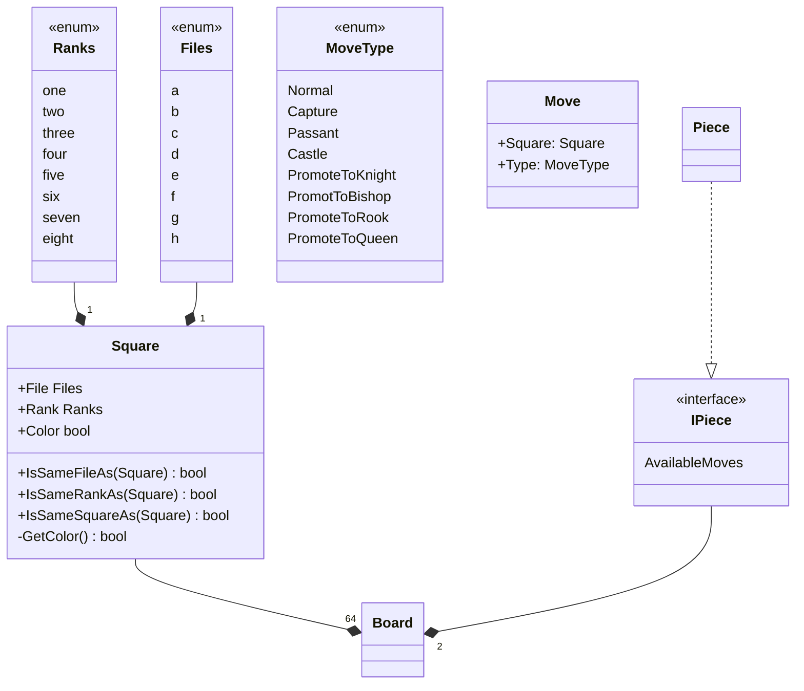

```mermaid
    classDiagram
    class Files{
        <<enum>>
        a
        b
        c
        d
        e
        f
        g
        h
    }
    class Ranks{
        <<enum>>
        one
        two
        three
        four
        five 
        six
        seven
        eight
    }
    class MoveType{
        <<enum>>
        Normal
        Capture
        Passant
        Castle
        PromoteToKnight
        PromotToBishop
        PromoteToRook
        PromoteToQueen
    }
    class Square{
        +File Files
        +Rank Ranks
        +Color bool
        +IsSameFileAs(Square) bool
        +IsSameRankAs(Square) bool
        +IsSameSquareAs(Square) bool
        -GetColor() bool
    }
    class Board{

    }
    class Move{
        +Square: Square
        +Type: MoveType
    }
    class IPiece{
        <<interface>>
        AvailableMoves
    }
    class Piece{

    }
    Ranks --* "1" Square
    Files --* "1" Square
    Square --* "64" Board
    IPiece --* "2" Board
    Piece ..|> IPiece
```