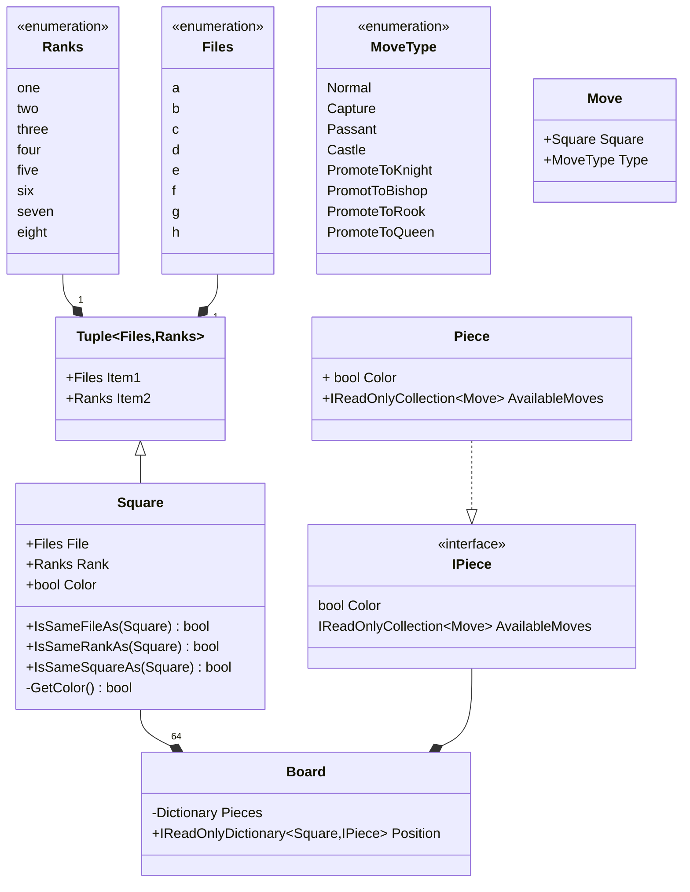

```mermaid
    classDiagram
    class Files{
        <<enumeration>>
        a
        b
        c
        d
        e
        f
        g
        h
    }
    class Ranks{
        <<enumeration>>
        one
        two
        three
        four
        five 
        six
        seven
        eight
    }
    class Tuple~Files,Ranks~{
        +Files Item1
        +Ranks Item2    
    }
    class MoveType{
        <<enumeration>>
        Normal
        Capture
        Passant
        Castle
        PromoteToKnight
        PromotToBishop
        PromoteToRook
        PromoteToQueen
    }
    class Square{
        +Files File
        +Ranks Rank
        +bool Color
        +IsSameFileAs(Square) bool
        +IsSameRankAs(Square) bool
        +IsSameSquareAs(Square) bool
        -GetColor() bool
    }
    class Board{
        -Dictionary<Square,IPiece> Pieces
        +IReadOnlyDictionary~Square,IPiece~ Position  
    }
    class Move{
        +Square Square
        +MoveType Type
    }
    class IPiece{
        <<interface>>
        bool Color
        IReadOnlyCollection~Move~ AvailableMoves 
    }
    class Piece{
        + bool Color
        +IReadOnlyCollection~Move~ AvailableMoves 
    }
    Ranks --* "1"  Tuple~Files,Ranks~
    Files --* "1"  Tuple~Files,Ranks~
    Tuple~Files,Ranks~ <|-- Square
    Square --* "64" Board
    IPiece --* "0..64" Board
    Piece ..|> IPiece
```