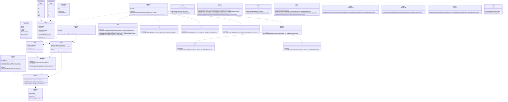

```mermaid
    classDiagram
    class Files{
        <<enumeration>>
        a
        b
        c
        d
        e
        f
        g
        h
    }
    class Ranks{
        <<enumeration>>
        one
        two
        three
        four
        five 
        six
        seven
        eight
    }
    class MoveType{
        <<enumeration>>
        Normal
        Capture
        Passant
        Castle
        PromoteToKnight
        PromoteToBishop
        PromoteToRook
        PromoteToQueen
    }
    class Through{
        <<enumeration>>
        Files
        Ranks
        MainDiagonal
        OppositeDiagonal
    }
    class Square{
        +Files File
        +Ranks Rank
        +bool Color
        +Square(Files, Ranks)
        +Square(Square)
        +IsSameFileAs(Square) bool
        +IsSameRankAs(Square) bool
        +IsSameSquareAs(Square) bool
        -GetColor() bool
    }
    class Board{
        -Dictionary~Square,IPiece~ Pieces
        +IReadOnlyDictionary~Square,IPiece~ Position 
        +Board()
        +Board(+IReadOnlyDictionary~Square,IPiece~)
    }
    class Move{
        +Square FromSquare
        +Square ToSquare
        +MoveType Type
        +Move(Square, Square, MoveTye)
    }
    class IPiece{
        <<interface>>
        bool Color
        AvailableMoves(IReadOnlyDictionary~Square,IPiece~) IReadOnlyCollection~Move~  
    }
    class Piece{
        <<abstract>>
        +bool Color
        +Piece(bool)
        +GetSquareFrom(IReadOnlyDictionary~Square,IPiece~) Square
        +AvailableMoves(IReadOnlyDictionary~Square,IPiece~)* IReadOnlyCollection~Move~  
    }
    class Pawn{
        +Pawn(bool)
        +AvailableMoves(IReadOnlyDictionary~Square,IPiece~) IReadOnlyCollection~Move~
        -PawnAttack(IReadOnlyDictionary~Square,IPiece~) IReadOnlyCollection~Move~
        -PawnMoveForward(IReadOnlyDictionary~Square,IPiece~) IReadOnlyCollection~Move~
        -UpdateToPromotions(Move) IReadOnlyCollection~Move~
    }
    class Knight{
        +Knight(bool)
        +AvailableMoves(IReadOnlyDictionary~Square,IPiece~) IReadOnlyCollection~Move~
    }
    class Bishop{
        +Bishop(bool)
        +AvailableMoves(IReadOnlyDictionary~Square,IPiece~) IReadOnlyCollection~Move~
    }
    class Rook{
        +Rook(bool)
        +AvailableMoves(IReadOnlyDictionary~Square,IPiece~) IReadOnlyCollection~Move~
    }
    class Royalty{
        <<Abstract>>
        +Royalty(bool)
        #RoyalAttack(IReadOnlyDictionary~Square,IPiece~, int) IReadOnlyCollection~Move~
    }
    class Queen{
        +Queen(bool)
        +AvailableMoves(IReadOnlyDictionary~Square,IPiece~) IReadOnlyCollection~Move~
    }
    class King{
        +King(bool)
        +AvailableMoves(IReadOnlyDictionary~Square,IPiece~) IReadOnlyCollection~Move~
    }
    class IChess{
        <<Interface>>
        IReadOnlyDictionary~Square,IPiece~ Position
        IReadOnlyCollection~MoveEntry~ MoveEntries
        AvailableMoves(bool)* IReadOnlyCollection~Move~
    }
    class Chess{
        <<Abstract>>
        -Board Board
        -List~MoveEntry~ _moveEntries
        +IReadOnlyDictionary~Square,IPiece~ Position
        +IReadOnlyCollection~MoveEntry~ MoveEntries
        +Chess()
        +Chess(+IReadOnlyDictionary~Square,IPiece~)
        +AvailableMoves(bool)* IReadOnlyCollection~Move~
    }
    class IGame{
        <<Interface>>
        int CurrentMove
        bool CurrentPlayer
        IChess Chess
        ProcessMove(Move) bool
    }
    class Maneuverability{
        <<static>>
        +MovePlus(this Square, int, int)$ Square
        +Maneuver(this Square, Through, int)$ Square
    }
    class Attacking{
        <<static>>
        +AttackSquare(this Piece, Square, IReadOnlyDictionary~Square,IPiece~)$ Move
        +Attack(this Piece, Square, bool, IReadOnlyDictionary~Square,IPiece~)$ IReadOnlyCollection~Move~
        -AttackSquare(this Square, Square, IReadOnlyDictionary~Square,IPiece~)$ Move
        -Attack(this Square, Through, bool, int, IReadOnlyDictionary~Square,IPiece~)$ HashSet~Move~
    }
    class Setup{
        <<static>>
        +AddPiece(this Board, Square, bool)$ bool
        +Copy(this Board, IReadOnlyDictionary~Square,IPiece~)$
    }
    class Helper{
        <<static>>
        +AddNonNull(this List~T~, T)$ bool
        +Unify(this IReadOnlyCollection~T~, IReadOnlyCollection~T~)$ IReadOnlyCollection~T~
        +HasMoved(this IPiece, IReadOnlyDictionary~Square,IPiece~, IReadOnlyCollection~MoveEntry~)$ bool 
        +InBetweenSquares(this Square, Square)$ IReadOnlyCollection~Square~
    }
    class MoveEntry{
        +Move Move
        +IReadOnlyDictionary~Square,IPiece~ Position
        -Board board
        +MoveEntry(Move, IReadOnlyDictionary~Square,IPiece~)
        +MoveEntry(Move, Board)
    }
    class PawnPassant{
        <<static>>
        +EnPassant(this IPiece, IReadOnlyDictionary~Square,IPiece~, IReadOnlyCollection~MoveEntry~)$ IReadOnlyCollection~Move~
    }
    class PawnRush{
        <<static>>
        +PawnFirstMove(this IPiece, IReadOnlyDictionary~Square,IPiece~)$ IReadOnlyCollection~Move~
    }
    class Castling{
        <<static>>
        +Castles(this IPiece, IReadOnlyDictionary~Square,IPiece, IReadOnlyCollection~MoveEntry~)$ IReadOnlyCollection~Move~
    }
    class Legality{
        <<static>>
        +IsChecked(this IChess, bool)$ bool
        +IsLegal(this IChess, Move)$ bool 
    }
    Ranks --* "1"  Square
    Files --* "1"  Square
    Square --* "0..64" Board
    MoveType --* Move
    Square --* Move
    IPiece --* "0..64" Board
    Piece ..|> IPiece
    Chess ..|> IChess
    Piece <|-- Pawn
    Piece <|-- Knight
    Piece <|-- Bishop
    Piece <|-- Rook
    Piece <|-- Royalty
    Royalty <|-- Queen
    Royalty <|-- King
    Move --* MoveEntry
    Board --* MoveEntry
    Board --* "1" IChess
    MoveEntry --* "*" IChess
    IChess --* "1" IGame
```