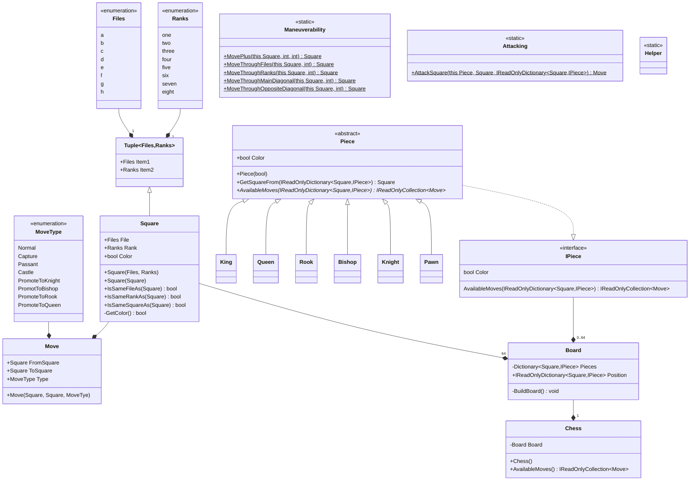

```mermaid
    classDiagram
    class Files{
        <<enumeration>>
        a
        b
        c
        d
        e
        f
        g
        h
    }
    class Ranks{
        <<enumeration>>
        one
        two
        three
        four
        five 
        six
        seven
        eight
    }
    class Tuple~Files,Ranks~{
        +Files Item1
        +Ranks Item2    
    }
    class MoveType{
        <<enumeration>>
        Normal
        Capture
        Passant
        Castle
        PromoteToKnight
        PromotToBishop
        PromoteToRook
        PromoteToQueen
    }
    class Square{
        +Files File
        +Ranks Rank
        +bool Color
        +Square(Files, Ranks)
        +Square(Square)
        +IsSameFileAs(Square) bool
        +IsSameRankAs(Square) bool
        +IsSameSquareAs(Square) bool
        -GetColor() bool
    }
    class Board{
        -Dictionary~Square,IPiece~ Pieces
        +IReadOnlyDictionary~Square,IPiece~ Position 
        -BuildBoard() void 
    }
    class Move{
        +Square FromSquare
        +Square ToSquare
        +MoveType Type
        +Move(Square, Square, MoveTye)
    }
    class IPiece{
        <<interface>>
        bool Color
        AvailableMoves(IReadOnlyDictionary~Square,IPiece~) IReadOnlyCollection~Move~  
    }
    class Piece{
        <<abstract>>
        +bool Color
        +Piece(bool)
        +GetSquareFrom(IReadOnlyDictionary~Square,IPiece~) Square
        +AvailableMoves(IReadOnlyDictionary~Square,IPiece~)* IReadOnlyCollection~Move~  
    }
    class Pawn{
    }
    class Knight{
    }
    class Bishop{
    }
    class Rook{
    }
    class Queen{
    }
    class King{
    }
    class Chess{
        -Board Board
        +Chess()
        +AvailableMoves() IReadOnlyCollection~Move~
    }
    class Maneuverability{
        <<static>>
        +MovePlus(this Square, int, int)$ Square
        +MoveThroughFiles(this Square, int)$ Square
        +MoveThroughRanks(this Square, int)$ Square
        +MoveThroughMainDiagonal(this Square, int)$ Square
        +MoveThroughOppositeDiagonal(this Square, int)$ Square
    }
    class Attacking{
        <<static>>
        +AttackSquare(this Piece, Square, IReadOnlyDictionary~Square,IPiece~)$ Move
    }
    class Helper{
        <<static>>
    }
    Ranks --* "1"  Tuple~Files,Ranks~
    Files --* "1"  Tuple~Files,Ranks~
    Tuple~Files,Ranks~ <|-- Square
    Square --* "64" Board
    Board --* "1" Chess
    MoveType --* Move
    Square --* Move
    IPiece --* "0..64" Board
    Piece ..|> IPiece
    Piece <|-- Pawn
    Piece <|-- Knight
    Piece <|-- Bishop
    Piece <|-- Rook
    Piece <|-- Queen
    Piece <|-- King
```