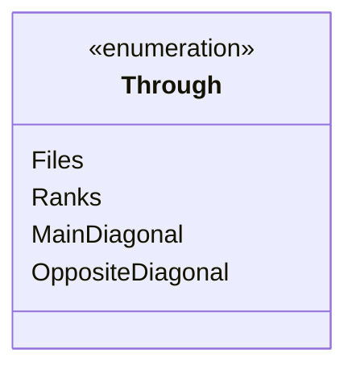
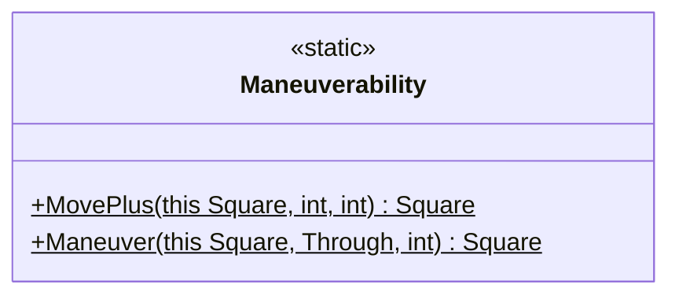
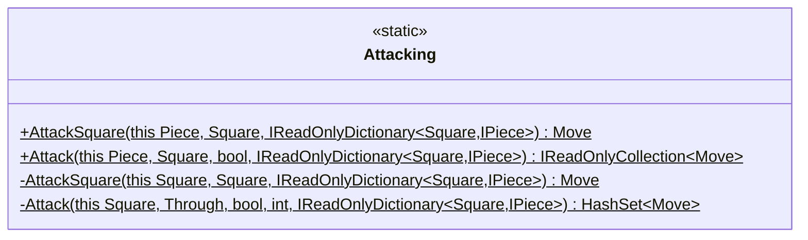
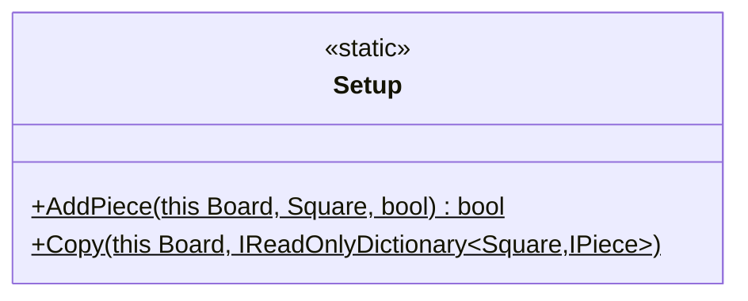
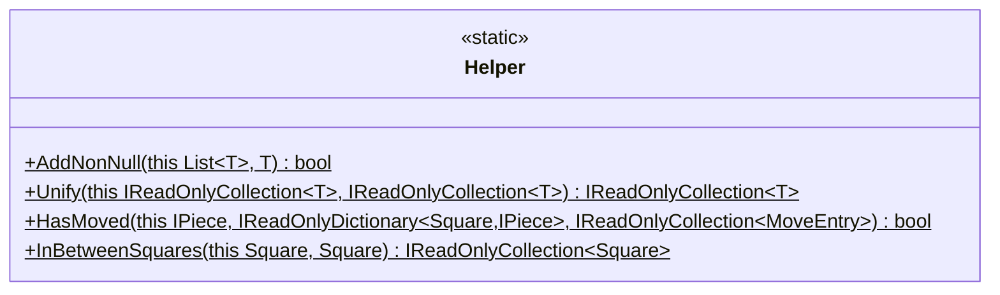
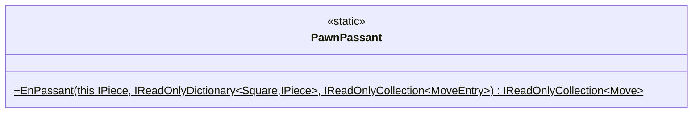
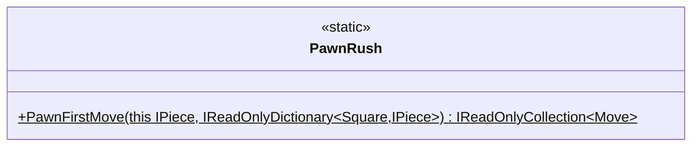
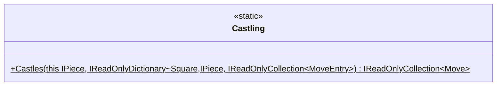

```mermaid
    classDiagram
    class Through{
        <<enumeration>>
        Files
        Ranks
        MainDiagonal
        OppositeDiagonal
    }
```

```mermaid
    classDiagram
    class Maneuverability{
        <<static>>
        +MovePlus(this Square, int, int)$ Square
        +Maneuver(this Square, Through, int)$ Square
    }
```

```mermaid
    classDiagram
    class Attacking{
        <<static>>
        +AttackSquare(this Piece, Square, IReadOnlyDictionary~Square,IPiece~)$ Move
        +Attack(this Piece, Square, bool, IReadOnlyDictionary~Square,IPiece~)$ IReadOnlyCollection~Move~
        -AttackSquare(this Square, Square, IReadOnlyDictionary~Square,IPiece~)$ Move
        -Attack(this Square, Through, bool, int, IReadOnlyDictionary~Square,IPiece~)$ HashSet~Move~
    }
```

```mermaid
    classDiagram
    class Setup{
        <<static>>
        +AddPiece(this Board, Square, bool)$ bool
        +Copy(this Board, IReadOnlyDictionary~Square,IPiece~)$
    }
```

```mermaid
    classDiagram
    class Helper{
        <<static>>
        +AddNonNull(this List~T~, T)$ bool
        +Unify(this IReadOnlyCollection~T~, IReadOnlyCollection~T~)$ IReadOnlyCollection~T~
        +HasMoved(this IPiece, IReadOnlyDictionary~Square,IPiece~, IReadOnlyCollection~MoveEntry~)$ bool 
        +InBetweenSquares(this Square, Square)$ IReadOnlyCollection~Square~
    }
```

```mermaid
    classDiagram
    class PawnPassant{
        <<static>>
        +EnPassant(this IPiece, IReadOnlyDictionary~Square,IPiece~, IReadOnlyCollection~MoveEntry~)$ IReadOnlyCollection~Move~
    }
```

```mermaid
    classDiagram
    class PawnRush{
        <<static>>
        +PawnFirstMove(this IPiece, IReadOnlyDictionary~Square,IPiece~)$ IReadOnlyCollection~Move~
    }
```

```mermaid
    classDiagram
    class Castling{
        <<static>>
        +Castles(this IPiece, IReadOnlyDictionary~Square,IPiece, IReadOnlyCollection~MoveEntry~)$ IReadOnlyCollection~Move~
    }
```

```mermaid
    classDiagram
    class Legality{
        <<static>>
        +IsChecked(this IChess, bool)$ bool
        +IsLegal(this IChess, Move)$ bool 
    }
```