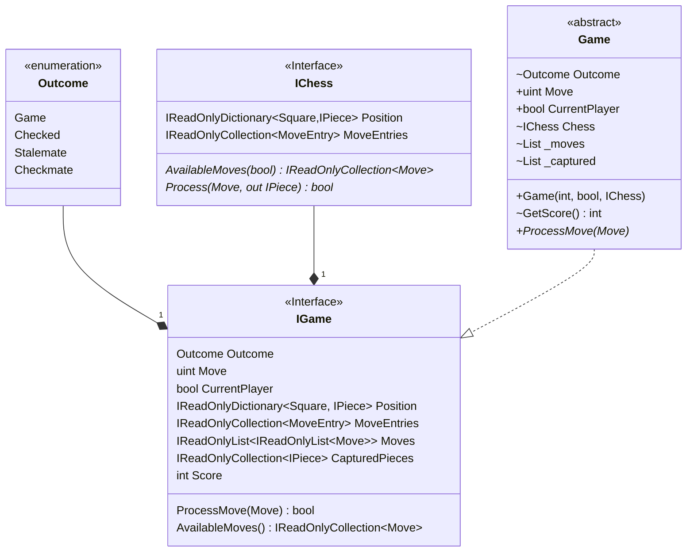

```mermaid
    classDiagram
    class Outcome{
        <<enumeration>>
        Game
        Checked
        Stalemate
        Checkmate
    }
    class IChess{
        <<Interface>>
        IReadOnlyDictionary~Square,IPiece~ Position
        IReadOnlyCollection~MoveEntry~ MoveEntries
        AvailableMoves(bool)* IReadOnlyCollection~Move~
        Process(Move, out IPiece)* bool
    }
    class IGame{
        <<Interface>>
        Outcome Outcome
        uint Move
        bool CurrentPlayer
        IReadOnlyDictionary~Square, IPiece~ Position
        IReadOnlyCollection~MoveEntry~ MoveEntries
        IReadOnlyList~IReadOnlyList~Move~~ Moves
        IReadOnlyCollection~IPiece~ CapturedPieces
        int Score
        ProcessMove(Move) bool
        AvailableMoves() IReadOnlyCollection~Move~
    }
    class Game{
        <<abstract>>
        ~Outcome Outcome
        +uint Move
        +bool CurrentPlayer
        ~IChess Chess
        ~List _moves
        ~List _captured
        +Game(int, bool, IChess)
        ~GetScore() int
        +ProcessMove(Move)*
    }
    Outcome --* "1" IGame
    IChess --* "1" IGame
    Game ..|> IGame
```