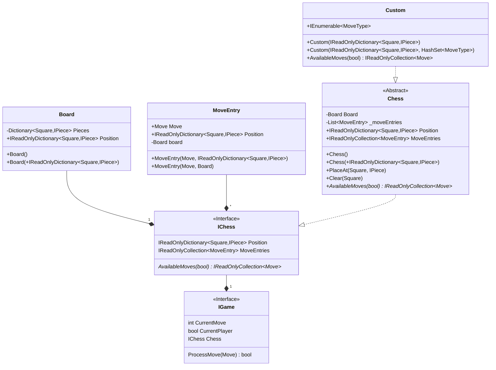

```mermaid
    classDiagram
    class IChess{
        <<Interface>>
        IReadOnlyDictionary~Square,IPiece~ Position
        IReadOnlyCollection~MoveEntry~ MoveEntries
        AvailableMoves(bool)* IReadOnlyCollection~Move~
    }
    class IGame{
        <<Interface>>
        int CurrentMove
        bool CurrentPlayer
        IChess Chess
        ProcessMove(Move) bool
    }
    class Chess{
        <<Abstract>>
        -Board Board
        -List~MoveEntry~ _moveEntries
        +IReadOnlyDictionary~Square,IPiece~ Position
        +IReadOnlyCollection~MoveEntry~ MoveEntries
        +Chess()
        +Chess(+IReadOnlyDictionary~Square,IPiece~)
        +PlaceAt(Square, IPiece) 
        +Clear(Square)
        +AvailableMoves(bool)* IReadOnlyCollection~Move~
    }
    class Board{
        -Dictionary~Square,IPiece~ Pieces
        +IReadOnlyDictionary~Square,IPiece~ Position 
        +Board()
        +Board(+IReadOnlyDictionary~Square,IPiece~)
    }
    class MoveEntry{
        +Move Move
        +IReadOnlyDictionary~Square,IPiece~ Position
        -Board board
        +MoveEntry(Move, IReadOnlyDictionary~Square,IPiece~)
        +MoveEntry(Move, Board)
    }
    class Custom{
        +IEnumerable~MoveType~
        +Custom(IReadOnlyDictionary~Square,IPiece~)
        +Custom(IReadOnlyDictionary~Square,IPiece~, HashSet~MoveType~)
        +AvailableMoves(bool) IReadOnlyCollection~Move~
    }
    Board --* "1" IChess
    MoveEntry --* "*" IChess
    Chess ..|> IChess
    IChess --* "1" IGame
    Custom ..|> Chess
```