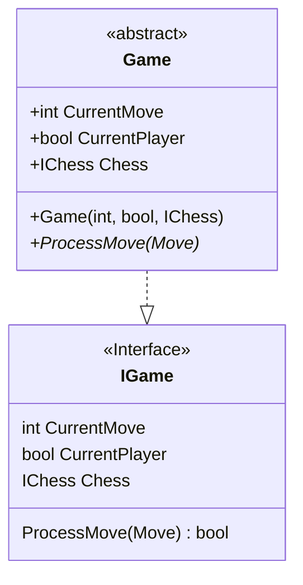

```mermaid
    classDiagram
    class IGame{
        <<Interface>>
        int CurrentMove
        bool CurrentPlayer
        IChess Chess
        ProcessMove(Move) bool
    }
    class Game{
        <<abstract>>
        +int CurrentMove
        +bool CurrentPlayer
        +IChess Chess
        +Game(int, bool, IChess)
        +ProcessMove(Move)*
    }
    Game ..|> IGame
```