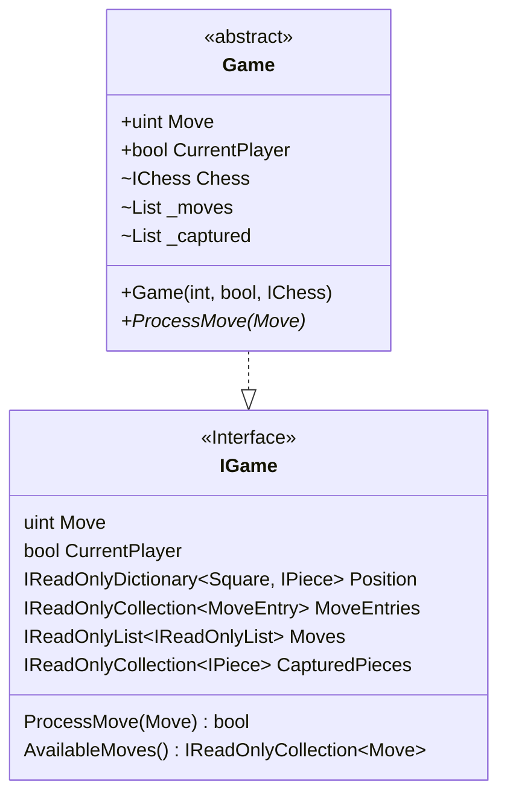

```mermaid
    classDiagram
    class IGame{
        <<Interface>>
        uint Move
        bool CurrentPlayer
        IReadOnlyDictionary~Square, IPiece~ Position
        IReadOnlyCollection~MoveEntry~ MoveEntries
        IReadOnlyList~IReadOnlyList<Move>~ Moves
        IReadOnlyCollection~IPiece~ CapturedPieces
        ProcessMove(Move) bool
        AvailableMoves() IReadOnlyCollection~Move~
    }
    class Game{
        <<abstract>>
        +uint Move
        +bool CurrentPlayer
        ~IChess Chess
        ~List _moves
        ~List _captured
        +Game(int, bool, IChess)
        +ProcessMove(Move)*
    }
    Game ..|> IGame
```