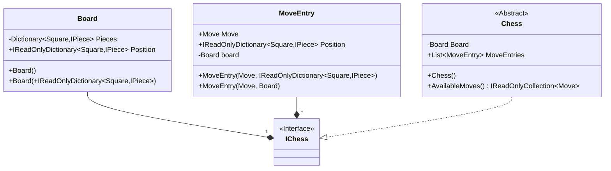

```mermaid
    classDiagram
    class IChess{
        <<Interface>>
    }
    class Chess{
        <<Abstract>>
        -Board Board
        +List~MoveEntry~ MoveEntries
        +Chess()
        +AvailableMoves() IReadOnlyCollection~Move~
    }
    class Board{
        -Dictionary~Square,IPiece~ Pieces
        +IReadOnlyDictionary~Square,IPiece~ Position 
        +Board()
        +Board(+IReadOnlyDictionary~Square,IPiece~)
    }
    class MoveEntry{
        +Move Move
        +IReadOnlyDictionary~Square,IPiece~ Position
        -Board board
        +MoveEntry(Move, IReadOnlyDictionary~Square,IPiece~)
        +MoveEntry(Move, Board)
    }
    Board --* "1" IChess
    MoveEntry --* "*" IChess
    Chess ..|> IChess
```