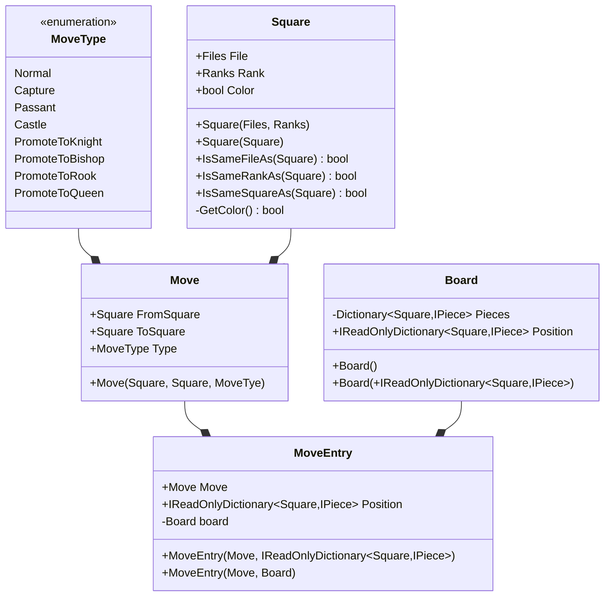

```mermaid
    classDiagram
    class MoveType{
        <<enumeration>>
        Normal
        Capture
        Passant
        Castle
        PromoteToKnight
        PromoteToBishop
        PromoteToRook
        PromoteToQueen
    }
    class Square{
        +Files File
        +Ranks Rank
        +bool Color
        +Square(Files, Ranks)
        +Square(Square)
        +IsSameFileAs(Square) bool
        +IsSameRankAs(Square) bool
        +IsSameSquareAs(Square) bool
        -GetColor() bool
    }
    class Move{
        +Square FromSquare
        +Square ToSquare
        +MoveType Type
        +Move(Square, Square, MoveTye)
    }
    class Board{
        -Dictionary~Square,IPiece~ Pieces
        +IReadOnlyDictionary~Square,IPiece~ Position 
        +Board()
        +Board(+IReadOnlyDictionary~Square,IPiece~)
    }
    class MoveEntry{
        +Move Move
        +IReadOnlyDictionary~Square,IPiece~ Position
        -Board board
        +MoveEntry(Move, IReadOnlyDictionary~Square,IPiece~)
        +MoveEntry(Move, Board)
    }
    MoveType --* Move
    Square --* "2" Move
    Move --* MoveEntry
    Board --* MoveEntry
```