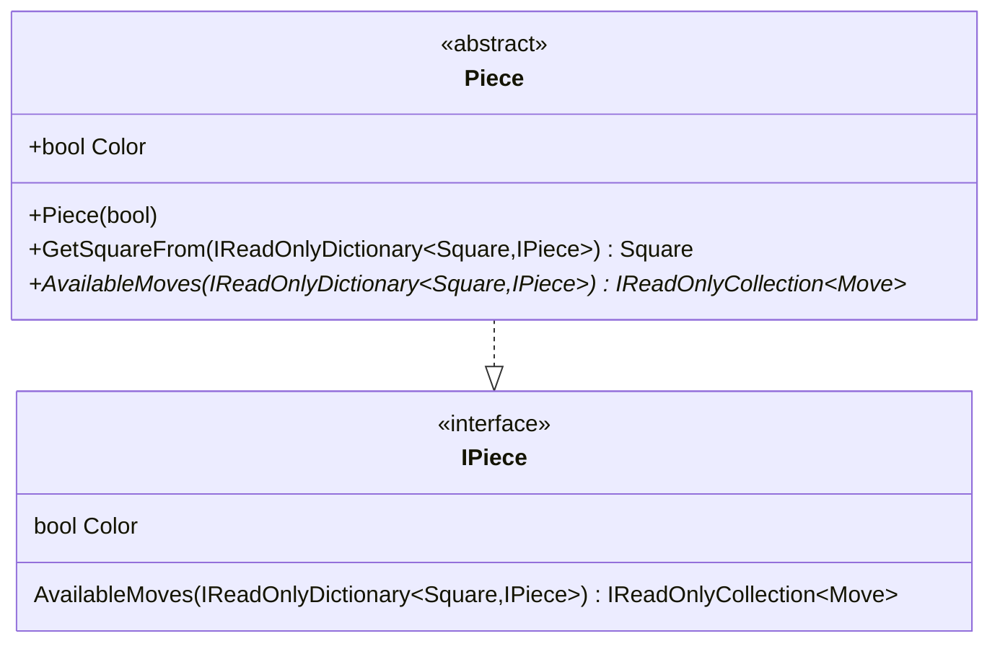
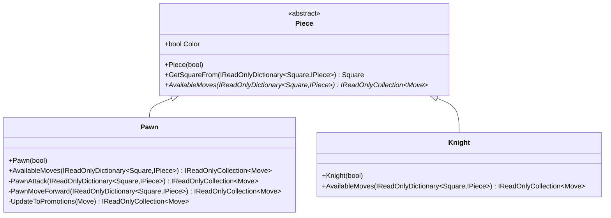
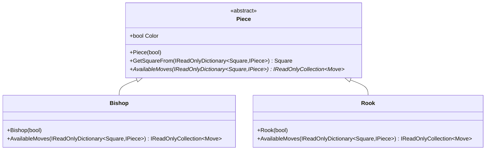
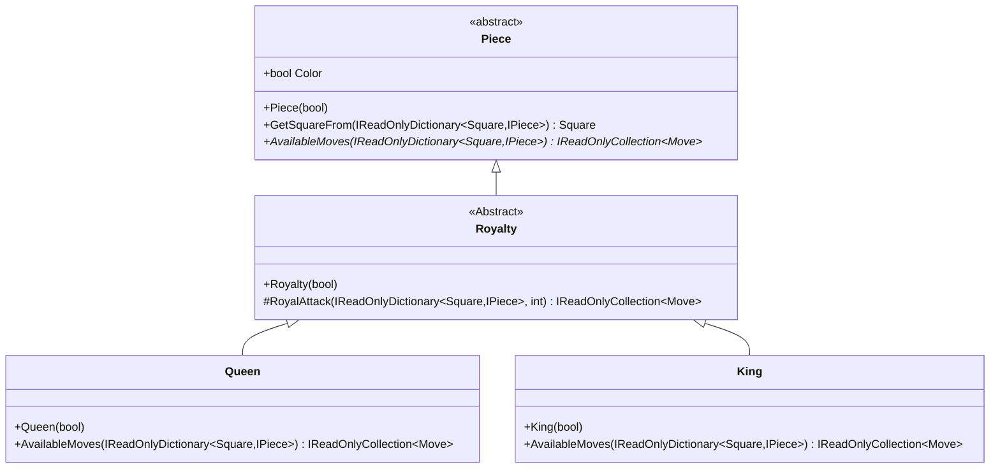

```mermaid
    classDiagram
    class IPiece{
        <<interface>>
        bool Color
        AvailableMoves(IReadOnlyDictionary~Square,IPiece~) IReadOnlyCollection~Move~  
    }
    class Piece{
        <<abstract>>
        +bool Color
        +Piece(bool)
        +GetSquareFrom(IReadOnlyDictionary~Square,IPiece~) Square
        +AvailableMoves(IReadOnlyDictionary~Square,IPiece~)* IReadOnlyCollection~Move~  
    }
    Piece ..|> IPiece
```

```mermaid
    classDiagram
    class Piece{
        <<abstract>>
        +bool Color
        +Piece(bool)
        +GetSquareFrom(IReadOnlyDictionary~Square,IPiece~) Square
        +AvailableMoves(IReadOnlyDictionary~Square,IPiece~)* IReadOnlyCollection~Move~  
    }
    class Pawn{
        +Pawn(bool)
        +AvailableMoves(IReadOnlyDictionary~Square,IPiece~) IReadOnlyCollection~Move~
        -PawnAttack(IReadOnlyDictionary~Square,IPiece~) IReadOnlyCollection~Move~
        -PawnMoveForward(IReadOnlyDictionary~Square,IPiece~) IReadOnlyCollection~Move~
        -UpdateToPromotions(Move) IReadOnlyCollection~Move~
    }
    class Knight{
        +Knight(bool)
        +AvailableMoves(IReadOnlyDictionary~Square,IPiece~) IReadOnlyCollection~Move~
    }
    Piece <|-- Pawn
    Piece <|-- Knight
```

```mermaid
    classDiagram
    class Piece{
        <<abstract>>
        +bool Color
        +Piece(bool)
        +GetSquareFrom(IReadOnlyDictionary~Square,IPiece~) Square
        +AvailableMoves(IReadOnlyDictionary~Square,IPiece~)* IReadOnlyCollection~Move~  
    }
    class Bishop{
        +Bishop(bool)
        +AvailableMoves(IReadOnlyDictionary~Square,IPiece~) IReadOnlyCollection~Move~
    }
    class Rook{
        +Rook(bool)
        +AvailableMoves(IReadOnlyDictionary~Square,IPiece~) IReadOnlyCollection~Move~
    }
    Piece <|-- Bishop
    Piece <|-- Rook
```

```mermaid
    classDiagram
    class Piece{
        <<abstract>>
        +bool Color
        +Piece(bool)
        +GetSquareFrom(IReadOnlyDictionary~Square,IPiece~) Square
        +AvailableMoves(IReadOnlyDictionary~Square,IPiece~)* IReadOnlyCollection~Move~  
    }
    class Royalty{
        <<Abstract>>
        +Royalty(bool)
        #RoyalAttack(IReadOnlyDictionary~Square,IPiece~, int) IReadOnlyCollection~Move~
    }
    class Queen{
        +Queen(bool)
        +AvailableMoves(IReadOnlyDictionary~Square,IPiece~) IReadOnlyCollection~Move~
    }
    class King{
        +King(bool)
        +AvailableMoves(IReadOnlyDictionary~Square,IPiece~) IReadOnlyCollection~Move~
    }
    Piece <|-- Royalty
    Royalty <|-- Queen
    Royalty <|-- King
```