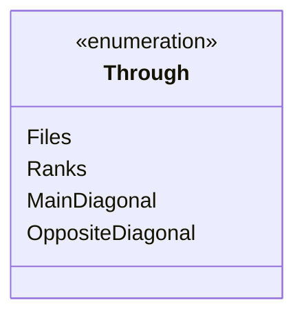
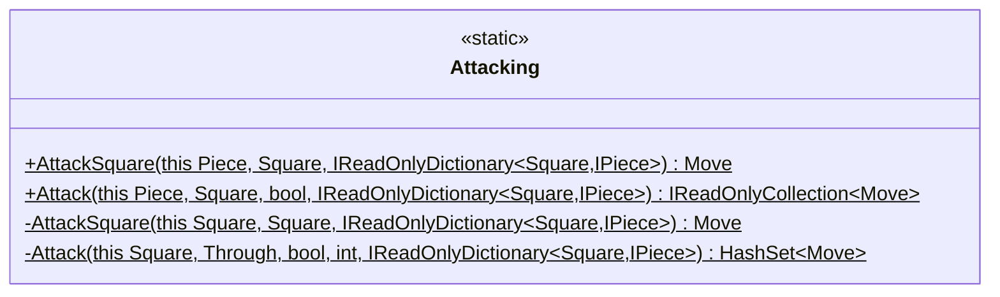
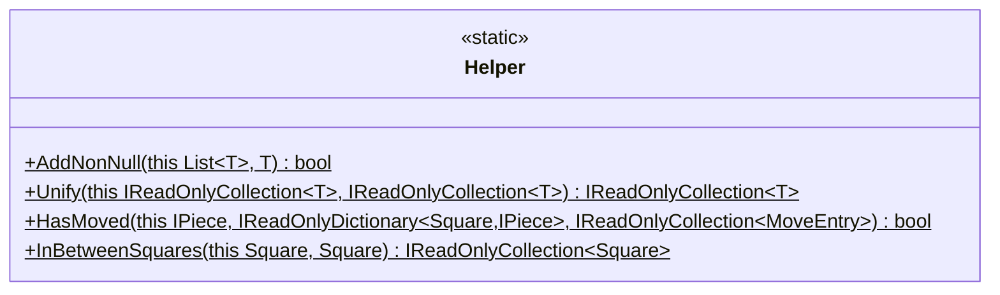
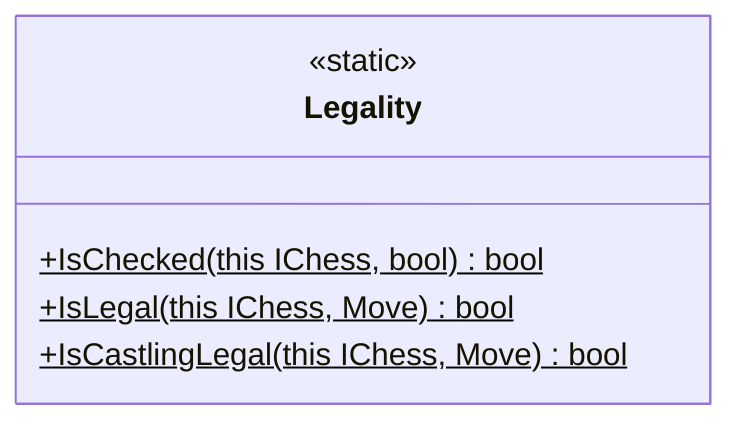
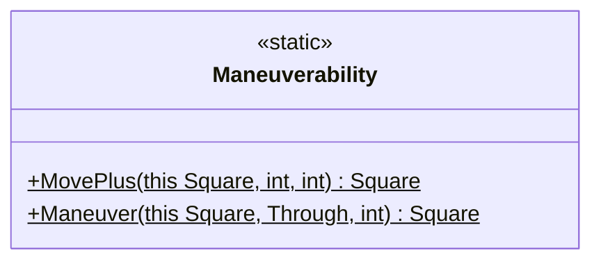
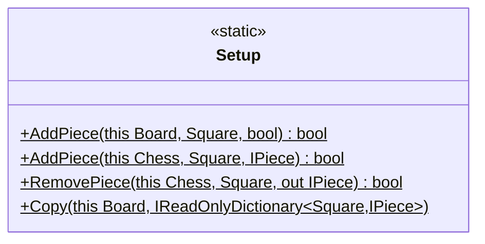
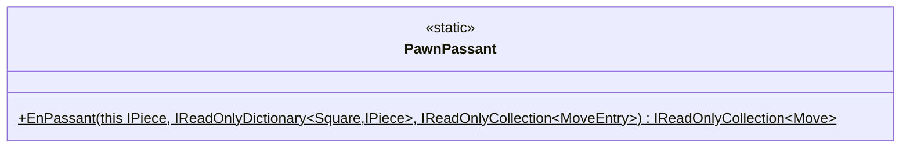
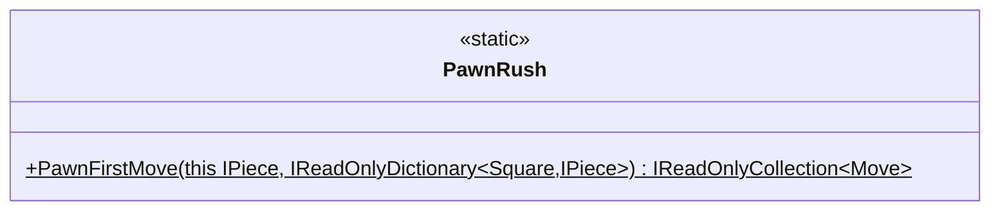
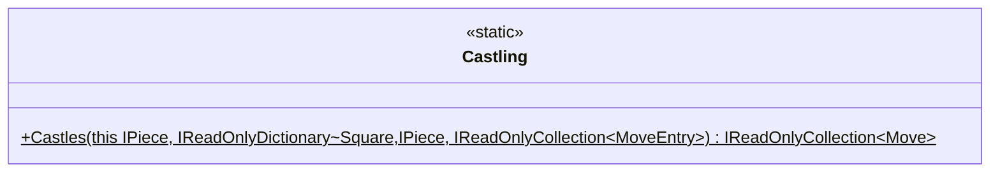

    
Enumerations Class Diagram

    

    
Attacking Class Diagram

    

    
Helper Class Diagram

    

    
Legality Class Diagram

    

    
Maneuverability Class Diagram

    

    
Setup Class Diagram

    

    
Passant Class Diagram

    

    
Rush Class Diagram

    

    
Castles Class Diagram

    

