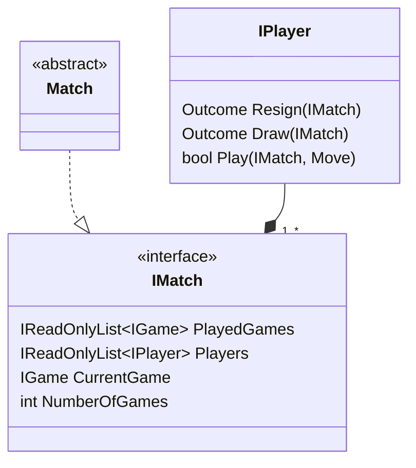

    
Match Class Diagram

    

```mermaid
    classDiagram
    class IMatch{
        <<interface>>
        IReadOnlyList~IGame~ PlayedGames
        IReadOnlyList~IPlayer~ Players 
        IGame CurrentGame
        int NumberOfGames
    }
    class Match{
        <<abstract>>
    }
    class IPlayer{
        Outcome Resign(IMatch)
        Outcome Draw(IMatch)
        bool Play(IMatch, Move)
    }
    Match ..|> IMatch
    IPlayer --* "1..*" IMatch
```

