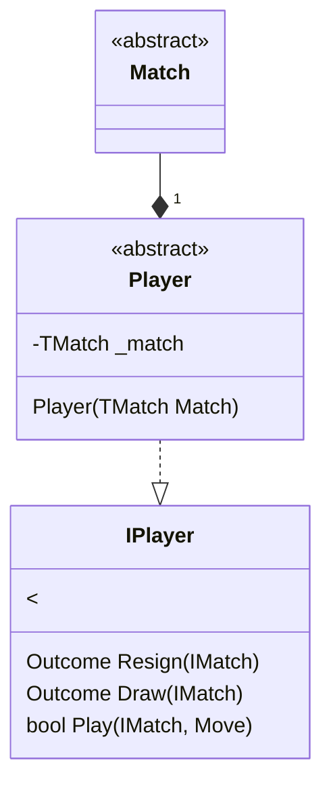

    
Player Class Diagram

    

```mermaid
classDiagram
    class IPlayer{
        <<interface>
        Outcome Resign(IMatch)
        Outcome Draw(IMatch)
        bool Play(IMatch, Move)
    }
    class Player{
        <<abstract>>
        -TMatch _match
        Player(TMatch Match) 
    }
    class Match{
        <<abstract>>
    }
    Player ..|> IPlayer
    Match --* "1" Player
```

