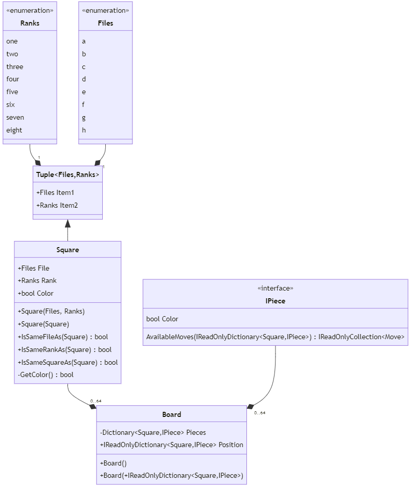
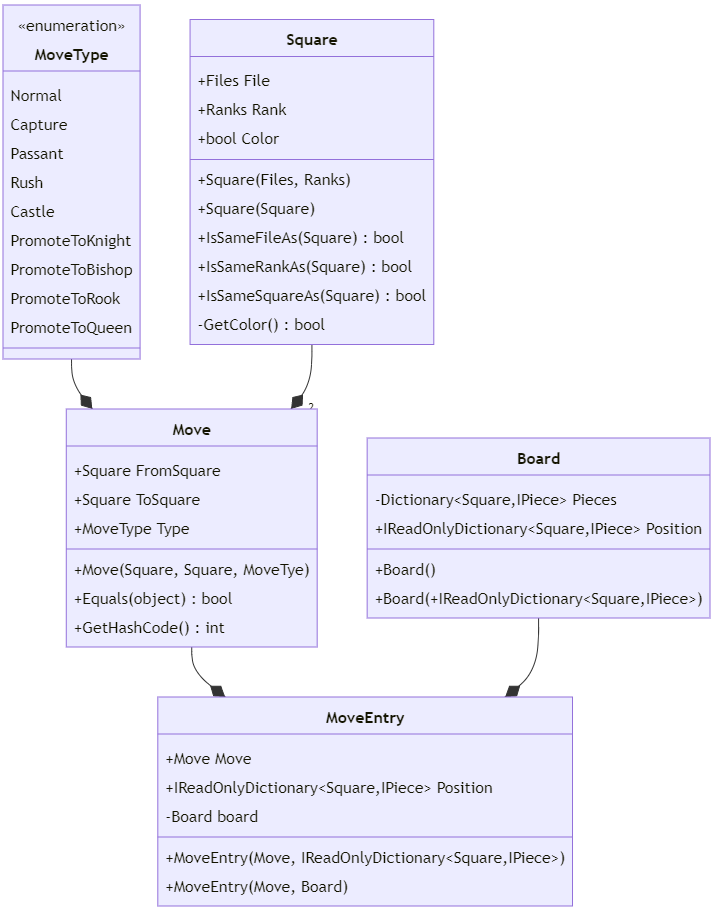
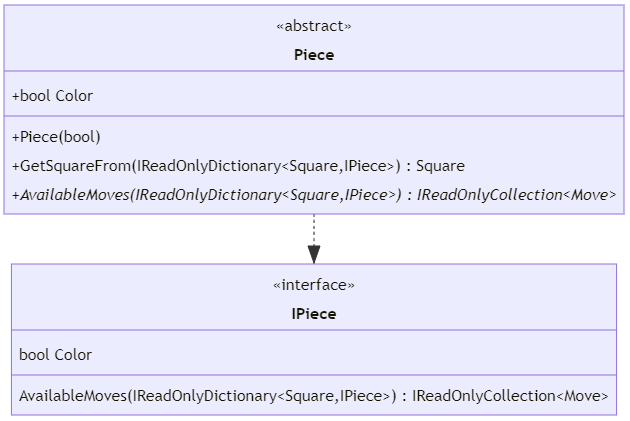
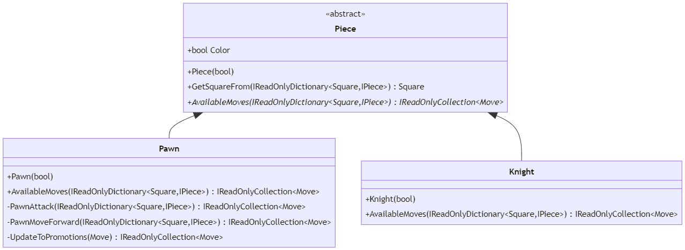
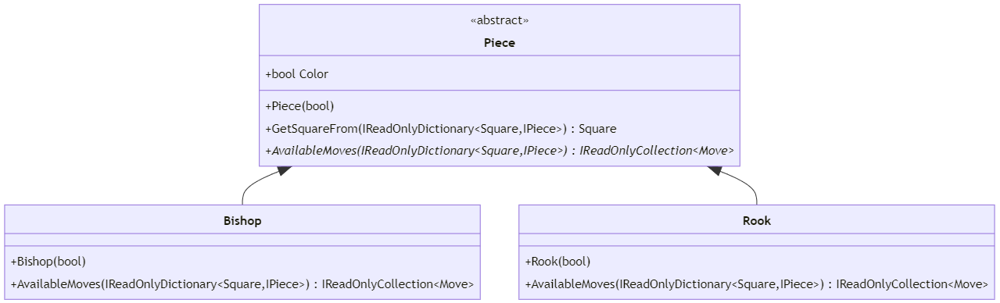
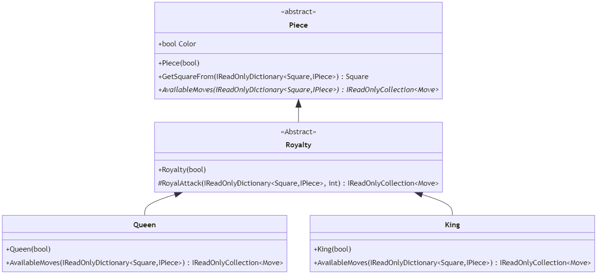

# Introduction

Mate is a passion project. It is my very own chess C# library and related API's. 

# Contents

* [Core UML Class Diagrams](#core-uml-class-diagrams)
    * [Board](#board)
    * [Game](#game)
    * [Moves](#moves)
    * [Pieces](#pieces)

# Core UML Class Diagrams

The core library can be found in `Source\Core`. It implements a chess match between players. It contains several different classes, representing multiple aspects of a game o chess. Bellow is a subdivision of each specific design choices for this class:
* Board;
* Game;
* Moves;
* Pieces.

## Board

Represents a board of chess, containing several different pieces, placed at specific squares.

### Classes

* [Source\Core\Abstractions\Enumerations.cs](Source/Core/Abstractions/Enumerations.cs);
    * Implements `Files` and `Ranks` enums;
* [Source\Core\Abstractions\Square.cs](Source/Core/Abstractions/Square.cs);
    * Inherits from `Tuple`;
* [Source\Core\Abstractions\IPiece.cs](Source/Core/Abstractions/IPiece.cs);
* [Source\Core\Elements\Board.cs](Source/Core/Elements/Board.cs).

### Diagrams

## Game

Represents a game of chess.

### Classes

* [Source\Core\Abstractions\Chess.cs](Source/Core/Abstractions/Chess.cs);
* [Source\Core\Abstractions\IChess.cs](Source/Core/Abstractions/IChess.cs);
* [Source\Core\Abstractions\IGame.cs](Source/Core/Abstractions/IGame.cs);
* [Source\Core\Abstractions\MoveEntry.cs](Source/Core/Abstractions/MoveEntry.cs);
* [Source\Core\Elements\Board.cs](Source/Core/Elements/Board.cs);
* [Source\Core\Elements\Rules\Custom.cs](Source/Core/Elements/Rules/Custom.cs).

### Diagrams

## Moves

Represents moves in a chess board.

### Classes

* [Source\Core\Abstractions\Enumerations.cs](Source/Core/Abstractions/Enumerations.cs);
    * Implements `MoveType` enum;
* [Source\Core\Abstractions\Move.cs](Source/Core/Abstractions/Move.cs);
* [Source\Core\Abstractions\MoveEntry.cs](Source/Core/Abstractions/MoveEntry.cs);
* [Source\Core\Abstractions\Square.cs](Source/Core/Abstractions/Square.cs);
* [Source\Core\Elements\Board.cs](Source/Core/Elements/Board.cs).

### Diagrams

## Pieces

Represents chess pieces.

### Classes

* [Source\Core\Abstractions\IPiece.cs](Source/Core/Abstractions/IPiece.cs);
* [Source\Core\Abstractions\Piece.cs](Source/Core/Abstractions/Piece.cs);
* [Source\Core\Abstractions\Royalty.cs](Source/Core/Abstractions/Royalty.cs);
* [Source\Core\Elements\Pieces\Bishop.cs](Source/Core/Elements/Pieces/Bishop.cs);
* [Source\Core\Elements\Pieces\King.cs](Source/Core/Elements/Pieces/King.cs);
* [Source\Core\Elements\Pieces\Knight.cs](Source/Core/Elements/Pieces/Knight.cs);
* [Source\Core\Elements\Pieces\Pawn.cs](Source/Core/Elements/Pieces/Pawn.cs);
* [Source\Core\Elements\Pieces\Queen.cs](Source/Core/Elements/Pieces/Queen.cs);
* [Source\Core\Elements\Pieces\Rook.cs](Source/Core/Elements/Pieces/Rook.cs).

### Diagrams

#### Pawn and Knight

#### Bishop and Rook

#### Queen and King

